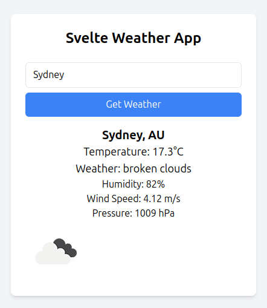

# Svelte Weather App

A simple weather application built with Svelte and Tailwind CSS. This app fetches real-time weather data for any city using the OpenWeatherMap API.


## Screenshot




## Getting Started

### Prerequisites

Make sure you have the following installed:

- **Node.js** (v14 or later)
- **npm** or **yarn**

### Installation

1. **Clone the repository**:

   ```bash
   git clone https://github.com/yourusername/svelte-weather-app.git
   cd svelte-weather-app

2. **NPM Install**:

    npm install

3. **Set up the OpenWeatherMap API key:**:

    Obtain a free API key from OpenWeatherMap.

    Create a .env file in the root directory and add your API key as VITE_OPENWEATHER_API_KEY=YOUR_API_KEY

4. **Run the application:**:

     npm run dev
